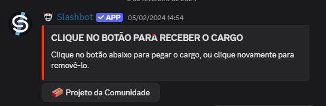

# InfOranger - O Bot Oficial da Orange Juice!

Fala, meu povo! Nós somos a **Orange Juice** 🍊, a comunidade mais vitaminada da área de tecnologia, e este é um dos primeiros projetos da comunidade!

O **InfOranger** é um bot idealizado para automatizar tarefas repetitivas na [nossa comunidade no Discord](https://discord.gg/WGgfYEwvzn), em especial aquelas tarefas relacionadas a informações sobre nossas iniciativas. Também tem como objetivo aumentar o engajamento dos nossos membros com projetos open source. 

## 💻 Tecnologias utilizadas
O **TypeScript** foi escolhido por ser uma linguagem forte e de simples aprendizado. Se você sabe um pouco de JavaScript, vai ver que a maior diferença entre as duas é a ênfase na tipagem de dados.

#### 📊 O que é tipagem de dados?
Sabe como existem serviços que só aceitam cartão de crédito, e outros que aceitam cartão de débito e PIX? Pense na tipagem como algo que especifica as formas de uso de uma variável assim como esses sistemas especificam as formas de pagamento. 

Existem linguagens de programação que têm tipagem dinâmica, como é o caso da JavaScript; o que basicamente significa que você pode "fazer o pagamento" da maneira que preferir. A TypeScript tem tipagem estática, o que significa que ela "limitará a forma de pagamento". A vantagem da tipagem estática é que ela evita TypeErrors inesperados - e ninguém merece que um bot pare de funcionar por um desses 👀

## 🤔 Como posso contribuir com o InfOranger?
1. Entre na [nossa comunidade do Discord](https://discord.gg/WGgfYEwvzn);
2. Adicione o canal #projetos-da-comunidade na sua lista;
3. Dentro de #projetos-da-comunidade, procure a conversa **INSTRUÇÕES SOBRE OS PROJETOS**;
4. Clique no botão indicado pelo Slashbot: ;
5. Agora você pode interagir com os Orangers que já estão trabalhando no projeto!

Adicione issues com as features que gostaria de ver, clone este repositório e mude a documentação, leia as linhas e mais linhas de código, abra pull requests, crie forks, deixa uma estrelinha - tudo isso conta como contribuição para o desenvolvimento do InfOranger!